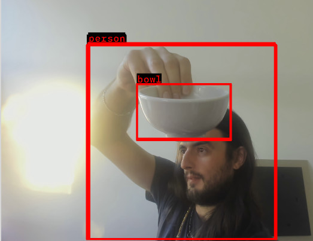

# Basis Test Robot

This is a living repo for demo robots used by Basis Robotics. Please take this as an example of how to use the framework, rather than production code ready to use in your own robot. Of note - there are examples of using unit and launch file arguments that may be useful.

Currently, it's only compilable on Orin, but other platforms will be coming.



## Compiling + running

Make sure you have a webcam plugged in before you start your docker container, or else it won't work.

1. Ensure that https://github.com/basis-robotics/basis/ is checked out alongside this repo.

2. Build and run the docker environment

```bash
docker/build-env.sh
docker/run-env.sh
```

3. Compile the code

```bash
# Within the docker environment...
cd /basis_test_robot/
mkdir build
cd build
cmake ..
make -j
sudo make install
```

4. Run the code

```bash
# Start coordinator
coordinator& # Or run within a separate tab, screen, tmux, etc

# Launch
basis launch ../launch/camera_pipeline.launch.yaml 
```

## Contents

There are a few libraries and units to note:

### lib/image_conversion

A library encapsulating image tools, with a class `CudaManagedImage` to handle working with a CUDA image and converting to serialized data. Of note - `CudaManagedImage` is used as an example of dual serialized/inproc types, meaning it's only serialized on demand.

### unit/v4l2_camera_driver

A unit to output images from a USB camera or similar. Pass in `--device <device_name>` if your camera is not at `/dev/video0`

### unit/yuyv_to_rgb

Converts YUYV to RGB using CUDA.

### unit/resnet_demo

An ML demo, using YOLOv8 to run image detection. Technically also supports resnet, but has poor performance (we should likely remove it). Uses onnx for model format. There's a slightly arcane process to generate the cached model - if there is interest we can either document it or make it much less arcane. 

Note: currently does not implement Non-Maximum Supression - this means you will get duplicate bounding boxes. It's a demo, after all.